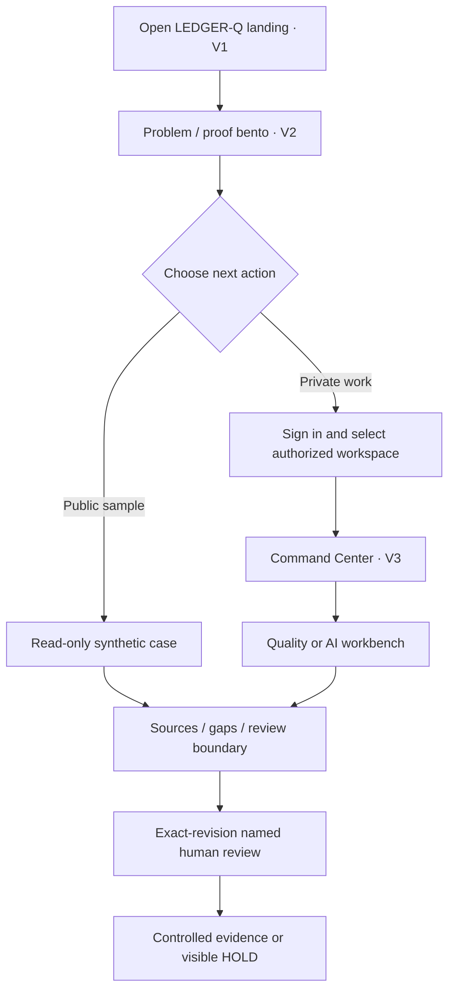
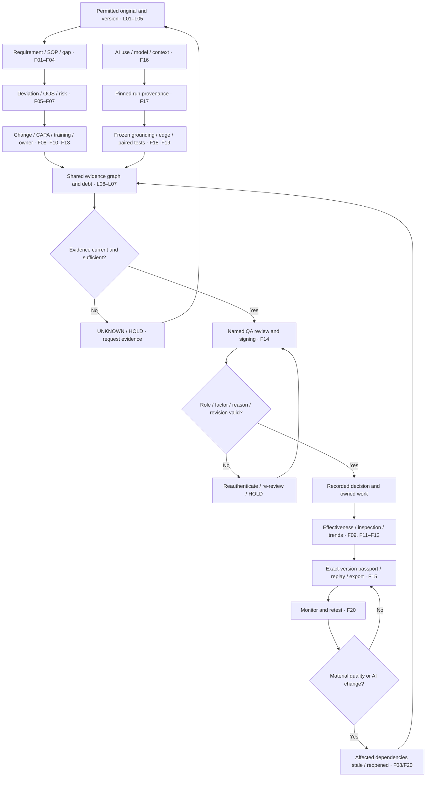
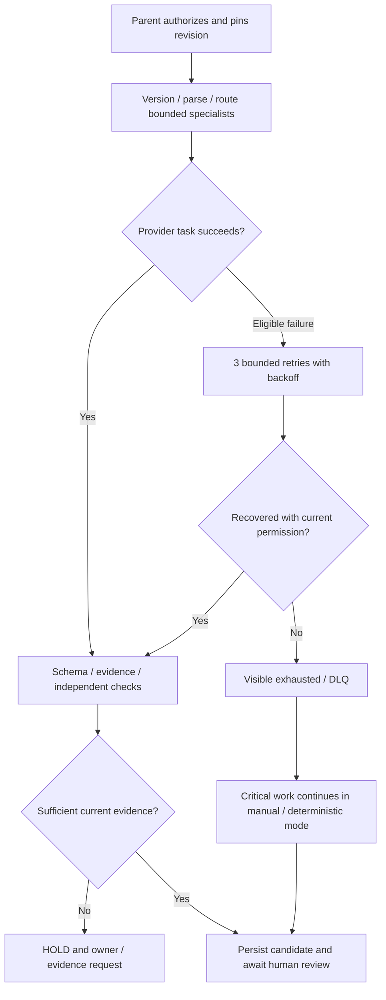

# LEDGER-Q — Complete PDF + Video Mapping and Master Architecture
Prepared 6 October 2026 · planning only, no LEDGER-Q app built or deployed

## Review scope and reference truth
The full 16-page PDF text and page layouts were inspected. All three complete recording timelines were sampled at 0.5-second cadence (2 frames/second), with detailed frames inspected for composition. This covers the observed sequence, not an assertion that every encoded frame was watched in real-time. These short clips show looping visual states; they do **not** show an end-to-end login, scrolling website, evidence graph, signature or export interaction. Those flows below are proposed tailored implementation behavior, not observed video behavior.

| Ref | Exact supplied file | Duration | Actually visible | Allocation |
|---|---|---|---|---|
| V1 | `Screen Recording 2026-10-05 182302.mp4` | 6.549 s | Synchro light icy-blue framed hero; huge pale PRODUCTION word; center articulated robotic arm; compact top nav; small floating metrics/cards; orange CTA; cyclic joint/claw rotation | Public landing composition and slow hero object movement |
| V2 | `Screen Recording 2026-10-05 182549.mp4` | 16.400 s | Synchro six-tile branding board: moving arm card, DM Sans typography/color card, badge/ID card, logo notification tile, social-frame card and tilted device/app dock; largely stable collage with repeating arm motion | Public bento/proof tiles, design system and small contextual artifact cards; not a functional dashboard or full website journey |
| V3 | `Screen Recording 2026-10-05 182643.mp4` | 7.168 s | Factory Dashboard: dark slim left icon rail; pale blue canvas; title/search/user area; top-left moving arm + compact metrics; top-right violet/orange bars; bottom donut, system-log list and gradient card | Authenticated Command Center grid, navigation, log/queue composition and information hierarchy |

Observed motion: V1 0–1.5 s angled open claw; about 2–4.5 s arm rotates/sweeps through frontal/left positions; by about 5–6 s returns toward earlier pose. V2 0–16.4 s preserves the branding-board layout while the top-left arm repeats. V3 0–4.5 s arm bends/rotates while charts/layout stay in place; about 5–7 s repeats toward the initial pose. No demonstrated scroll-trigger or page-to-page transition is inferred.

## What will be kept, changed and added
| Reference element | Keep | Tailor to LEDGER-Q | Reason / source |
|---|---|---|---|
| V1 framed icy-blue hero | Main composition, generous balanced space, nav and compact corner cards | LEDGER-Q title, quality/AI dual-stream explanation, real controlled-demo CTA; smaller 28–40 px statement instead of giant illegible heading | PDF p10 typography/readability |
| V1 robotic articulated motion | Slow joint rhythm and subtle depth on public hero | Original evidence-stack / dual-stream mechanism: source cards and AI-use cards converge at a visible human gate; no industrial production claim | PDF p1/p6/p10 dual logic |
| V1 fake speed/24/7/100% counters | Placement only | Labelled saved-fixture counts/status or omit when no executed evidence; timestamps with completed-check semantics | PDF p14–15 claim discipline |
| V2 bento/card shapes | Mixed card sizes, thin borders, balanced gradients, compact label hierarchy | Source version tile; event chronology; signed decision specimen; release passport; adverse-test receipt; trace preview. Different relevant thumbnails per tile | PDF p9–10 actual product proof |
| V2 DM Sans and orange/violet branding | Font treatment and restrained accent motifs | Use licensed available font + verified fallback; navy/cyan active evidence; amber needs-review; red critical; green only approved | PDF p10 mandatory status semantics |
| V2 badge/social/device mockups | Framing pattern when useful | Version-bound review/permission card, public-safe work-sample and mobile review view; no invented staff credential, testimonial or client logo | PDF p8–10 roles and proof |
| V3 sidebar/top bar | Persistent rail, search/context, compact shell | Text-labelled canonical routes, tenant/product/site/use context, independent nav/content scroll, visible user/role/signout | PDF p9 enterprise shell |
| V3 robotic motion on operational dashboard | Spatial layout | Replace continuous decorative arm with quiet evidence/context card; limited functional selection/trace/state motion. Optional hero animation remains public-only | PDF p10 limits operational motion |
| V3 donut/bars/logs | Readable visual card composition | Evidence-debt categories; quality-event queue; critical AI failure denominators; overdue actions; registry release states; append-oriented real event log | PDF p9 command-center cards |
| Hover/scroll/close behavior not shown | No claim it exists in footage | Add keyboard focus, modest reveal on public page, dialog close/Escape/back, dependency-node selection; reduced-motion static alternative | PDF p15 accessibility + proposed UX addition |

Do not copy screenshots or foreign logos/sample numbers into a working product. Recreate the composition with original LEDGER-Q components, source-bound data and lawful assets. “5D/7D/8D” is a visual request for depth and motion; implementation will be ordinary 3D/projection, not a technical capability claim.

## Reference-based visual specification — proposed tailoring
Public page: cool blue/slate surrounding frame, soft blue/off-white inner cards, deep navy headings and restrained cyan evidence accents. Authenticated shell: deep navy rail/top context plus readable slate/light cards; event-status colors keep PDF meanings. Suggested starting tokens, **not colors measured from original footage**: navy #122338; slate #273E55; ice #E5EEF8; card #F5F7FB; cyan #2AB7D1; review amber #B67512; blocked red #B73642; approved green #197650. Verify contrast with actual text sizes before acceptance.

Hero: original dual-stream evidence mechanism moves slowly (12–18 s loop), with small depth/parallax and no fabricated live counters. Intro logo reveal, if used, ≤0.6 s and skippable; it must not block login or loading. Public hover elevation ≤3 px, zoom ≤1.015; scroll reveal 180–280 ms and repeatable only when readable. Dashboard motion is functional and brief: trace highlight, selected-node transition, status-confirmation. Respect reduced motion, hidden-tab/offscreen suspension and user pause. Loading/data errors remain textual and actionable, never masked by motion.

## PDF page-by-page coverage
| Pages | Requirements preserved here |
|---|---|
| 1 | Identity, dual quality/AI streams, human authority and design-target truth boundary |
| 2 | Architecture lock, F01–F10, proposed-control status, no standalone training OS |
| 3 | F11–F20 and shared L01–L07 |
| 4 | L08–L12, P01–P05 and R01–R04 |
| 5 | Permission-scoped deterministic/vision intake, fidelity coordinates, 3 retries/DLQ/manual continuity |
| 6 | Seven feature/layer linkage stages; quality/AI convergence; five release states |
| 7 | Signature gate, signing-time two-factor, reason, revision hash, failure states, Part 11 truth boundary |
| 8 | Eight user journeys, five user roles, command-center route |
| 9 | Remaining canonical navigation, eight command-center panels, desktop shell |
| 10 | Color/type/motion boundaries, eight public sections, reference stack |
| 11 | Remaining runtime stack, 16 core data objects, first API routes |
| 12 | Product/Site/User external UUID MDM readiness, mapping history and authorization separation |
| 13 | Remaining API routes, seven specialists, parent runtime/state/idempotency |
| 14 | Twelve test families and most outcome measures |
| 15 | Remaining metrics, security/privacy/recovery, specified→production maturity gates |
| 16 | Master build rules/order, usage optimization and final acceptance checklist |

## Canonical feature-to-layer-to-screen-to-proof map
Every row below is **SPECIFIED / NOT BUILT IN THIS TASK**. Proposed implementation allocations preserve PDF feature meanings. Full sortable version: `LEDGER_Q_Feature_Traceability.csv`.

| ID / canonical feature | PDF layers | Screen | Saved objects / owner | Must-pass evidence |
|---|---|---|---|---|
| F01 — Controlled Quality Source & Document Registry (p2) | L01-L04, L06 | `/sources` | controlled_sources; Intake + evidence verifier | Retain original bytes, permission, effective date, predecessor and hash; reject unauthorized intake. |
| F02 — Requirement Extraction & Exact Evidence Traceability (p2) | L04-L07, L09-L11 | `/requirements` | requirements; Requirement mapping specialist | Every accepted requirement links exact source/version/span; remove support and it must become UNKNOWN. |
| F03 — Regulation-to-SOP / Requirement Mapping (p2) | L04-L07, L09-L11 | `/requirements` | sop_mappings; Requirement mapping specialist | Require context/version/rationale; missing SOP cannot be shown as covered. |
| F04 — Compliance Gap, Conflict & Evidence-Sufficiency Control (p2) | L05-L08, L10-L11 | `/requirements, /app` | dependency_edges + evidence debt records; Evidence / audit verifier | Missing/conflicting/stale support remains visible debt and blocks unsafe progression. |
| F05 — Quality Risk, Severity & Confidence Assessment (p2) | L06, L08, L10-L11 | `/events, /review` | quality_events + human_decisions; Domain specialist + QA | Separate severity, likelihood, controls, evidence sufficiency and confidence; no model score substitutes for human risk acceptance. |
| F06 — Deviation Investigation Review (p2) | L04-L09, L10-L11 | `/events` | investigation_records; Deviation/OOS specialist | Preserve chronology, hypotheses and gaps; only named human determines root cause/disposition. |
| F07 — OOS/OOT Investigation Review (p2) | L04-L09, L10-L11 | `/events` | quality_events + investigation_records; Deviation/OOS specialist | Retain laboratory source/method/result; ambiguous chromatogram requests review; AI never chooses disposition. |
| F08 — Bidirectional Change-Control & Impact Assessment (p2) | L04, L06-L12 | `/changes` | dependency_edges; Change-impact specialist | SOP change stales dependent AI assurance; model/prompt/tool/data/policy change reopens affected quality/training review. |
| F09 — RCA-CAPA Lifecycle & Effectiveness Verification (p2) | L04, L06-L12 | `/capa` | capa_actions; CAPA/effectiveness specialist | Separate proposed cause from human-established cause; closure blocked without implementation/effectiveness evidence. |
| F10 — Training Impact & Retraining Traceability (p2) | L02, L04, L06-L08, L10-L12 | `/training` | training_impacts; Change-impact specialist + role owner | Link affected roles and completion evidence to correct changed version; no standalone training AI OS. |
| F11 — Audit / Inspection Finding & Readiness Management (p3) | L02, L04, L06-L08, L10-L12 | `/inspection` | quality_events + capa_actions + exports; Evidence / audit verifier | Finding, gap, owner, action and closure reconstructable; unresolved debt stays visible. |
| F12 — PQR/APQR & Quality Trend Review (p3) | L04-L08, L11-L12 | `/trends` | quality_events + evaluation_runs; Domain aggregation + human reviewer | Show denominators/time windows; correlation is never an automatic scientific conclusion. |
| F13 — Owner, Deadline, Escalation & Closure Control (p3) | L02, L08, L10-L12 | `/app, /capa, /review` | capa_actions + assigned work; Parent workflow + owner | Persist due date/escalation; owner cannot use missing evidence to close work. |
| F14 — Human QA Review, Override & Controlled Correction (p3) | L02, L04, L08, L10-L11 | `/review` | human_decisions; Named authorized human only | Approve/revise/request/reject/suspend/escalate exact revision; stale signature or role fails closed; no silent self-training. |
| F15 — Audit/Version Reconstruction, Event Forensics & Controlled Export (p3) | L02-L04, L07-L12 | `/audit` | audit_events + exports + release_passports; Evidence / audit verifier | Reconstruct original versions and AI contribution; export permission-filtered approved evidence; preserve open gaps. |
| F16 — AI Model / Use / Context & Release Registry (p3) | L01-L04, L06-L08, L10-L11 | `/ai-registry` | ai_uses + release_passports; AI provenance specialist | Intended/excluded use, owner, reviewer and exact model dependencies required; no unsupported VALID state. |
| F17 — AI Provenance, Transparency & Contribution Record (p3) | L03-L07, L09-L11 | `/ai-registry, /audit` | ai_runs; AI provenance specialist | Retain prompt/config/tools/inputs/retrieval/output/model/human use; immutable past run identity. |
| F18 — AI Evaluation, Grounding & Hallucination Suite (p3) | L05-L07, L09-L11 | `/ai-evaluation` | evaluation_runs; AI evaluation specialist | Frozen expected/actual evidence and citation checks; conflicting assessors and critical failures remain visible. |
| F19 — Bias, Edge-Case & Consistency Verification (p3) | L04, L06, L09-L11 | `/ai-evaluation` | evaluation_runs; AI evaluation specialist | Subgroups, adverse cases, repeated-run variation and paired model comparisons with denominators/limits. |
| F20 — Assurance Monitoring, Regression, Blast Radius & Revalidation (p3) | L04, L06-L12 | `/changes, /ai-evaluation, /app` | evaluation_runs + dependency_edges + release_passports; Change-impact + AI evaluation specialists | Changed dependency invalidates current assurance; retest plus fresh human approval needed before restored use. |

## Shared layers — no parallel replacement architecture

| ID | Exact PDF name | Implementation responsibility |
|---|---|---|
| L01 | Workspace & Tenant Isolation | Tenant filters at database, object storage, retrieval, graph, tasks and exports. |
| L02 | Identity, Roles & Approval | Named QA, owner, SME, admin and approver with current authority checks. |
| L03 | Authorized Source & Intake | Permission, purpose, type, byte limit and approved-source checks before parsing/provider calls. |
| L04 | Storage, Metadata, Versioning & Release Records | Originals, hashes, histories, model/config versions, runs and release passports. |
| L05 | Domain Parsing & Normalization | Typed text/tables first; vision only for visual evidence; retain original coordinates. |
| L06 | Source / Policy / Context & Staleness Governance | Authority/intended-use/policy/context and bidirectional invalidation rules. |
| L07 | Evidence Graph, Retrieval, Assurance Debt & Blast Radius | Relational edges linking requirements, quality objects, AI uses, decisions and outputs. |
| L08 | Workflow State, Reopening & Orchestration | One parent controls routing, waits, leases, retries, reopening and safe terminal states. |
| L09 | Multi-Agent & Multi-Model Routing | Bounded named candidate specialists with model pins and outage protocol. |
| L10 | Safety, Security & Human Decision | No autonomous regulated root cause/disposition/closure/release; enforce human authority. |
| L11 | Evaluation, Audit, Correction Firewall & Revalidation | Frozen tests, corrections, failure preservation, regression, retest and traceable evidence. |
| L12 | Integration, Operations & Scale | Reviewed APIs, notification outbox, worker operations, backups, rollback and later scale. |

## Proposed child controls and challenge controls
These are retained from the PDF, **not verified world-first claims**. Their feature/layer allocations below are proposed implementation links.

| ID | PDF control | Attached feature/layer | Proof required |
|---|---|---|---|
| LQ-P01 | Cross-domain dependency invalidation | F08/F20; L06-L08/L11 | Test quality→AI and AI→quality invalidation without changing historical approvals. |
| LQ-P02 | Reconstructable failure / AI-contribution forensics | F06/F07/F15/F17; L04/L07/L11 | Replay exact original contribution and first failure; unresolved cause remains UNKNOWN. |
| LQ-P03 | Human-correction regression firewall | F14/F18/F20; L04/L10/L11 | Correction → proposed regression case → QA approval → version → retest; no silent training. |
| LQ-P04 | Assurance debt + conflicting-assessor / blast-radius panel | F04/F08/F18/F20; L07/L11 | Deterministic/model/human disagreements and affected objects visible; missing evidence cannot be outvoted. |
| LQ-P05 | Non-gaming trust report | F12/F18-F20; L11 | Task success, abstention, critical failure cost, review burden and denominators shown separately. |
| LQ-R01 | Pharma critical-error challenge pack | F18/F19; L11 | Mutate units, operators, batch, version and evidence; retain actual failed cases. |
| LQ-R02 | Evidence-removal challenge | F04/F18; L07/L11 | Remove support; demand abstention or a valid authorized alternate source. |
| LQ-R03 | Task-specific model-change comparison | F19/F20; L09/L11 | Paired critical cases stay visible even if aggregate score improves. |
| LQ-R04 | Failure-location report | F15/F18/F20; L11 | Report first evidenced break; do not fabricate the unresolved cause. |

## PDF enhancements requiring explicit implementation
**Vision intake (p5):** L01/L03 check tenant/source/purpose permission; L05 runs deterministic extraction first and conditionally routes chromatograms, HPLC graphs, handwritten notes and nested tables to approved vision/document AI. Candidate JSON retains source version, page/region, table/series ID, raw observation, units, method, confidence and parser/model identity. Original remains authoritative. Unreadable/ambiguous → UNKNOWN/NEEDS_REVIEW. “Loss-minimizing” target, not unvalidated “lossless” claim.

**Outage handling (p5):** L09 eligible AI/API failure → three automatic retries with exponential backoff → DLQ for noncritical tasks. Persist exact revision/run/cause/attempt. Recovery checks current authorization/policy. Critical quality event, evidence, rules, owner routing and named QA work stay available in deterministic/manual mode. AI outage never suppresses a quality state or closes/releases work.

**Signing (p7):** F13/F14 configured decision transition → exact-revision human review → SIGNATURE_REQUIRED → Password + OTP or approved biometric second factor at signing → role/current revision/hash/reason check → approved/rejected event and UTC audit record. Reason choice Authored/Reviewed/Approved; append-oriented revision/decision hash with chain reference where implemented. Failure → HOLD/REAUTHENTICATE/RE-REVIEW. A biometric route requires an approved real identity method; it is not simulated by an icon. Compliance-targeted, not proven Part 11 compliance.

**MDM (p12):** Product_ID, Site_ID and User_ID remain stable local keys with optional external_uuid, external_system, mapping_status, effective time and mapping history. UNMAPPED/MATCHED/CONFLICT/RETIRED. An external identity match does not grant tenant access, reviewer authority or signature rights. Only authorized mapping can contribute to cross-module blast radius. LEDGER-Q is not the enterprise master-data authority.

## Nine agentic parts — allocated without replacing L01–L12
| Part | Where | Actual responsibility / proof |
|---|---|---|
| Goal interpretation / planning | L08 + L09 | Bounded task plan, required evidence and next permitted action; failure/conflict may replan, never bypass human gate |
| Tool integration | L03/L05/L12 | Approved source/parsing/DB/provider/export adapters; allowlist/permission/typed outputs tested |
| Memory | L04/L06/L07 | Current approved context + versioned history; tenant-scoped retrieval; corrections do not silently become memory |
| Orchestration / runtime | L08/L12 | One parent, persisted jobs, waits/retries/leases/idempotency/DLQ; works without browser |
| Multi-agent collaboration | L09 + L11 | Seven scoped specialists, shared exact revision, candidate merge/disagreement; no approval by voting |
| HITL | L02/L08/L10 | Named reviewer exact revision, revise/request/reject/suspend/escalate; signing gate |
| Safety / policy | L01–L03/L06/L10 | Tenant/role/purpose, injection defense, network/file limits and blocked unauthorized effects |
| Observability / evaluation | L11/L12 | Correlation trace, frozen expected/actual tests, latency/cost when available, retained failure and denominators |
| Governance / accountability | L04/L06/L10/L11 | Provenance, append history, controlled correction, retention and version-bound passport/export |

“Agentic” is justified only by executed planning/routing/collaboration records. Deterministic specialist functions are labelled deterministic. A live provider receipt is separate from scientific validation. No decorative unrestricted swarm.

## Shared data and agent handoff contract — proposed implementation detail
Every candidate packet carries tenant/workspace, correlation/run, task kind, source ID/version/hash/span, input/output revision, policy/config/model version, permitted purpose, gaps/uncertainties, status, owner and next action. Original records live in the controlled store; agents pass authorized references and typed candidates, not a global unscoped memory dump.

1. Parent checks authority, exact revision, purpose and idempotency; freezes input fingerprint.
2. It routes only needed tasks to seven named specialists and waits for bounded outcomes.
3. Specialists cannot grant roles, pick arbitrary external tools or approve their own output. A document/prompt injection is data, not an instruction.
4. Evidence verifier and deterministic schema/numeric/source checks compare candidates. Disagreement returns visible debt/UNKNOWN/HOLD, not majority acceptance.
5. Parent commits candidates with compare-and-swap on the current revision and stores provenance. Late/stale responses are retained as failed/cancelled traces without overwriting new work.
6. Human decision binds exact revision and source/test dependencies; changed evidence invalidates current approval and requires new review/signature.

| Specialist (PDF p13) | Reads / produces | Prohibited authority |
|---|---|---|
| Requirement mapping | Controlled sources → requirement/span/mapping candidates | Invent coverage / approve compliance |
| Deviation/OOS | Quality originals + chronology → gaps and hypotheses | Determine root cause/disposition |
| Change impact | Dependency edges + exact changes → blast-radius/stale candidates | Close/release affected controls |
| CAPA/effectiveness | Approved cause/action/evidence → effectiveness candidates | Approve CAPA closure |
| AI provenance | Pinned model/prompt/tool/input/output → contribution record | Rewrite prior run / hide config |
| AI evaluation | Frozen approved cases → grounding/bias/edge/regression outcomes | Hide critical failures in aggregate |
| Evidence/audit verifier | Version hashes + decision chain → integrity/reconstruction checks | Override named human QA authority |

## Core saved objects and relationships (all 16 from PDF p11)
| Object | What must be saved / connection |
|---|---|
| workspaces | Tenant, site/product/process context, policy/schema/workflow version |
| controlled_sources | SOP/policy/form/record/dataset, permission/owner/effective date, version/hash/predecessor |
| requirements | Typed requirement, exact source/span/version and applicability rationale |
| sop_mappings | Requirement → SOP/process/version; coverage, gap/conflict state |
| quality_events | Deviation/OOS/OOT/finding/change, chronology/risk/status/evidence |
| investigation_records | Hypotheses, gaps and evidence; human disposition and AI-contribution refs |
| capa_actions | Human-established/candidate cause distinction, actions, owner/due/implementation/effectiveness/closure |
| training_impacts | Changed version, affected role, requirement and completion evidence |
| ai_uses | Model/version/use/exclusions/context/dependencies/owner/reviewer/release state |
| ai_runs | Exact prompt/config/tools/input/retrieval/output/model identity/human use |
| evaluation_runs | Frozen case/version, expected/actual, critical failures, grounding/bias/edge/first break |
| dependency_edges | Source/SOP/process/product/batch/training/AI/output/decision links with stale state |
| human_decisions | Exact revision/action/rationale/residual risk/approver/UTC/signing metadata |
| release_passports | Use + context/version/evidence/tests/limits/approver/state/history |
| audit_events | Ordered cross-stream events with correlation/revision/hash references |
| exports | Controlled packet manifest, redactions, exact versions and release flag |

**Proposed supporting tables (not extra canonical features):** persisted jobs/checkpoints/DLQ, notification outbox, immutable source spans, evidence-debt items, external mapping history, signature factor events and approved regression-case versions. Needed to implement the PDF behavior transparently; exact schema chosen at stack lock.

## API contract allocation (all 12 proposed PDF endpoints)
| Route | Purpose | Guard |
|---|---|---|
| POST /sources | Register source/version | Permission/type/purpose/tenant |
| POST /requirements/extract | Candidate requirements/spans | No accepted requirement without exact evidence |
| POST /mappings | SOP/process/version mapping | Missing rationale → review |
| POST /events | Quality event + chronology | Typed source context; no AI disposition |
| POST /impact/calculate | Bidirectional affected objects | Mark stale/reopen; preserve history |
| POST /capa | Action/effectiveness record | Evidence + human closure |
| POST /ai-uses | Intended use/model/context | No unsupported VALID state |
| POST /ai-runs | AI contribution/provenance | Immutable exact run/evidence identity |
| POST /evaluations/run | Frozen/adverse case results | Denominators/first failures retained |
| POST /reviews/{id}/decision | Named QA action | Current role, expected revision, signature reason/factors |
| POST /revalidate | Critical retest after change | Fresh review required before release state update |
| POST /exports | Controlled evidence/passport packet | Permission-filtered, version-bound approved evidence |

The PDF lists **12** endpoints (3 on p11 and 9 on p13). This count is checked against the rows above. Read-only GET detail/queues/history and explicit authentication/signature-step endpoints are proposed supporting APIs, not new top-level features. Worker resume/cancel/dead-letter endpoints require authorization and idempotency.

## Exact workflow and release-state semantics
Parent state sequence from PDF p13:
`START → AUTHORIZED → INPUT_VERSIONED → PARSED → CANDIDATE_READY → VALIDATED → HUMAN_REVIEW_REQUIRED → APPROVED / REVISED / REQUEST_EVIDENCE / REJECTED → ACTION_OPEN → VERIFIED / CLOSED`, with visible `HOLD / EXHAUSTED` branches. These are workflow states, not automatic regulatory disposition. No failed step becomes success.

Signature sequence from PDF p7:
`DRAFT → HUMAN_REVIEW_REQUIRED → SIGNATURE_REQUIRED → AUTHENTICATED → APPROVED / REJECTED`. Current role, two-factor result, controlled reason and exact revision/hash must pass at the signing event. Authentication failure, stale revision, missing reason or mismatch means HOLD / REAUTHENTICATE / RE-REVIEW.

| AI-use release state (PDF p6) | Exact meaning |
|---|---|
| VALID | Approved evidence and intended-use context remain current |
| SUSPENDED | Temporary hold while an issue or change is investigated |
| EXPIRED | Time, context or version trigger requires revalidation |
| REVOKED | Evidence/control failure makes prior release unusable |
| REVALIDATED | Required retest plus named human approval restore controlled use |

This state applies to the defined AI use/passport; it is not batch-release authority, medicine approval or an autonomous quality-event closure. Old states remain reconstructable after any transition.

## Canonical navigation and video links
| Route | Purpose | Reference + data |
|---|---|---|
| / | Public landing | V1 hero, V2 bento, PDF p10 eight sections |
| /app | Assurance Command Center | V3 grid; saved open events/debt/release states/overdue/critical tests |
| /sources | Controlled Sources | Quiet tables/document preview; F01 originals |
| /requirements | Requirements & SOP Map | Mapping table + exact source drawer; F02–F04 |
| /events | Quality Events | Chronology/evidence/risk workbench; F05–F07 |
| /changes | Change & Blast Radius | Functional node/edge highlight on selected saved dependency; F08/F20 |
| /capa | RCA-CAPA & Effectiveness | Owned action/evidence/closure; F09/F13 |
| /training | Training Impact | Correct-version role/record list; F10 |
| /inspection | Inspection Readiness | Finding→action→evidence packets; F11/F15 |
| /trends | PQR/APQR & Trends | Saved denominators/time windows, exceptions; F12 |
| /ai-registry | AI Use & Release Registry | Use/model/context/passport/state; F16/F17 |
| /ai-evaluation | AI Evaluation Lab | Frozen cases/actual failures/paired comparison; F18/F19 |
| /review | Human QA Review Queue | Exact evidence/revision + signing workflow; F14 |
| /audit | Replay / Forensics / Export | Immutable history/source/run/decision reconstruction; F15 |
| /settings | Organisation / Controls | Role/policy/test pack/integration/notification settings; L02/L06/L12 |

Detail panels always show status, source/version, owner, uncertainty, limitation and next permitted action. Keep nav independently scrollable and content panel stable. A graph panel is proposed LEDGER-Q functionality from the PDF, not an interaction shown in these videos.

## Public landing sequence
1. Optional short logo reveal → V1-framed LEDGER-Q hero with dual-stream mechanism and controlled-demo CTA.
2. Problem strip → fragmented quality evidence and the separate AI trust problem.
3. How it works → quality + AI evidence converge on named human authority, saved versions and reconstructable history.
4. Evidence/human control → missing/stale/conflict examples and exact-source preview.
5. V2-inspired product bento → different source/event/review/passport/trend/trace thumbnails from actual synthetic records once built.
6. Architecture → source/API/parent/state/evidence/evaluation/human gate; restrained layered depth.
7. Proof/limitations → executed receipts only, scope/date/denominator; known gaps visible.
8. Closing CTA/contact → actual demo/work sample/code links only when available. No fake waitlist position or inactive link.

## Visitor → workspace connection flow

Public case must not create a customer workspace or imitate professional approval. Sign-in and document permission prompts differ: public safe read needs no fake authentication; protected work and provider transmission use their actual authorization/consent.

## Master backend flowchart — two streams, one authority

F14 governs regulated decisions across F05–F20. A permitted AI-use passport state is not permission to release a medicine or autonomously close a quality event.

## Runtime and provider failure connection

Manual continuity does not fabricate a failed AI task’s result; it preserves critical quality operations and the unresolved provider gap.

## Synthetic integrated work sample — proposed fixture, not built
**Product:** SQ-100 immediate-release tablet, Site SYN-S1, Batch SYN-B01; wholly synthetic portfolio exercise. No commercial disposition or regulatory submission.

| Episode | Fixture | Expected correct behavior |
|---|---|---|
| Requirement/SOP | Synthetic source requires current documented assay procedure; SOP-QA-101 v1 covers it | Exact requirement span + reviewed mapping; no source-free coverage |
| Deviation/OOS candidate | Lab record A and B report incompatible assay entries for same batch/method | Conflict visible; no selected/averaged authoritative result and no autonomous OOS disposition |
| Visual intake | Labelled synthetic chromatogram with an ambiguous area/handwritten annotation | Original image retained; conditional vision candidate + coordinates; ambiguity UNKNOWN |
| CAPA candidate | Investigator proposes transcription-check action | Candidate cause/action only; named QA decides; effectiveness evidence still required |
| Training change | SOP-QA-101 v2 changes approved handling steps | Affected roles/completions for v1 become stale; new-version training/review trace |
| AI onboarding | Lab-summary AI use, intended-use exclusions, model/prompt/config pins | Frozen source-grounding tests; unsupported answer escapes blocked; no VALID before review |
| Quality → AI change | SOP v2 changes required evidence | Dependent AI tests/passport suspended/expired as policy requires; retest/review |
| AI → quality change | Model/prompt/tool revision changes behavior | Affected SOP/validation/training/quality controls reopened with graph path |
| Correction firewall | Human corrects model value | New governed correction; benchmark/memory unchanged until authorized regression approval/version |
| Historical replay | Select earlier decision before change | Reconstruct then-current source/run/decision; current versions do not rewrite history |
| Signing negative | Wrong role, expired OTP, missing reason or stale revision | HOLD/reauth/re-review; no signature completion |
| Controlled positive path | All required fixture evidence supplied, tests current, named test-human authority exercised | Version-bound recorded decision; still labelled synthetic exercise, not real professional qualification |

A second intentionally unresolved case stays HOLD on missing effectiveness evidence. Demonstrate both successful bounded workflow and preserved uncertainty; do not invent closure to make the demo look complete.

## Test families — all 12 from PDF p14
| Family | Must demonstrate |
|---|---|
| Source / requirement | Authorized vs wrong purpose; exact span; stale version |
| Mapping / gap | Covered requirement vs missing SOP/conflicting versions |
| Deviation / OOS | Chronology completeness; absent evidence; AI hypotheses vs human disposition |
| Change / blast radius | Both quality→AI and AI→quality; unrelated objects remain current |
| CAPA / effectiveness | Implemented action vs missing effect proof/recurrence; closure block |
| Human correction firewall | Governed correction and blocked silent benchmark/memory update |
| AI grounding | Supported citation vs missing/unsupported claim |
| Bias / edge / consistency | Subgroups, repeated runs, paired critical failures |
| Release passport | Valid→change→suspended/expired→retest→human revalidated |
| Assurance debt | Missing/stale/conflicting evidence + affected object paths |
| Tenant / role | Wrong tenant/role retrieval/review/export denied |
| Restore / replay | Historical quality + AI decision restored with matching original IDs/hashes |

Additional implementation checks: provider redirects/allowlist/private-network rejection, retries/DLQ replay/idempotency, late responses/concurrency, signature factor/reason/hash, malformed files/parsing limits, injection attempts, public safe projection, keyboard/dialog/focus, nav scroll isolation, reduced motion and mobile.

## Outcome measurements — all 12 PDF measures, not invented results
| Measure | Denominator / interpretation |
|---|---|
| Requirement trace coverage | Accepted requirements with exact source/version/location ÷ accepted requirements |
| Open assurance debt | Count + age of missing/stale/conflicting items by severity |
| Quality event review completeness | Events with required chronology/evidence/reviewer fields ÷ reviewed events |
| CAPA effectiveness completion | Due CAPAs with required effectiveness evidence + human closure ÷ CAPAs due |
| Reopened dependency precision | Correctly reopened objects ÷ reopened objects in frozen change cases |
| AI grounding pass rate | Supported/cited expected cases passed ÷ grounding cases; critical failures separate |
| Unsupported output escape rate | Unsupported outputs incorrectly accepted ÷ unsupported challenge cases |
| Abstention / request-evidence rate | Abstained/evidence-request cases ÷ evaluation cases; show task success alongside |
| Critical edge-case pass | Critical cases passed ÷ critical cases; no aggregate masking |
| Release-state freshness | VALID uses with current required dependencies/tests ÷ all VALID uses |
| Human override/correction rate | Reviewer overrides/corrections ÷ reviewed AI-assisted outputs; rationale categories |
| Inspection reconstruction completeness | Required source/event/action/decision items recovered ÷ required reconstruction items |

A 0 denominator is NOT_MEASURED/NOT_APPLICABLE with reason, not automatic 100%. Real active-effort savings and error reduction require qualified expected answers, users and a comparable manual baseline; not demonstrated by fixtures.

## Proposed gap-closing additions — no extra canonical features
| Proposal | Existing home | Why / proof |
|---|---|---|
| A01 Version-locked shared contract registry | L04/L08/L11 | Single schemas and source/model/policy fingerprints; reject mismatched candidates |
| A02 Independent nav scroll + responsive workbench | L12 / frontend | Prevent sidebar moving with detail content; tested keyboard/mobile paths |
| A03 Public saved proof projection | F15/L01/L10 | Read-only synthetic canonical record, hash/readback verified; no private workspace or approval impersonation |
| A04 Decision-ready detail drawer | F14/L07 | Always status/evidence/version/owner/limit/next action; close/Escape/back/focus tests |
| A05 Privacy-safe public assurance summary | F18–F20/L11 | Expose scope/outcome/limitations only; never prompts/secrets/private controls |
| A06 Operator heartbeat + completed-run freshness | L08/L12/F20 | Scheduled config separate from actual completions; failed/overdue → evidence gap |
| A07 Export manifest with expiry/verification state | F15/L04/L10 | Current hash/revision/dependencies/authorization; stale packet cannot masquerade as current release |
| A08 Risk-based work priorities | F05/F13/L08 | Owner can inspect due/critical/open debt; no hidden auto-disposition |

These are proposed implementation details needed to close common BEACON/FORGE gaps. They are not new verified product differentiators, not extra F21+/L13+ and not already deployed.

## Security and operational rules preserved
Least privilege and tenant/role checks before retrieval/review/export/model access; network allowlist and redirect recheck/private-network block/timeout/size control; current-revision concurrency; server-side secrets; append-oriented auditable history without unsupported tamper-proof claim; original-ID/hash restore rehearsal; confidential data only under appropriate permission/contracts/environment controls; accessible contrast/focus/labels/reduced motion. Parent worker independent of browser; measured latency/cost reported only when actually captured. Scale according to tested workload, not “global enterprise” marketing.

## Next action after review
First freeze stack + schemas/state + synthetic expected outcomes; then source→requirement→gap→event→human decision saved slice, followed by connected AI assurance/change/revalidation and controlled export. This task delivers the plan and mappings. LEDGER-Q app, credentials, deployment, professional validation and production outcomes are **not** claimed complete.
